# Hi there, I'm Mücahid (Kripteks) 👋
### Software Engineer & Game Developer

  
  
  

---

### 🚀 About Me

- 🎮 **Game Engineering:** Focused on robust gameplay architecture, modern UI Toolkit/uGUI systems, and URP pipelines in **Unity (C#)**.
- 💻 **Software Architecture:** Strong foundations in **.NET, TypeScript, Go**, and full-stack system design.
- 🎯 **Engineering Principles:** Committed to clean architecture, testable domain layers, performance optimization, and scalable codebases.
- 📍 **Location:** Turkey 🇹🇷

---

### 🛠️ Technical Arsenal

#### 🎮 Game Development & Core Engine

  
  
  
  
  

#### 💻 Languages & Web Technologies

  
  
  
  
  
  
  
  

#### 🗄️ Databases, DevOps & Tooling

  
  
  
  
  
  

---

### 📊 GitHub Activity & Metrics

  

  

---

### 🌐 Connect & Socials

  
  
  
  
  

